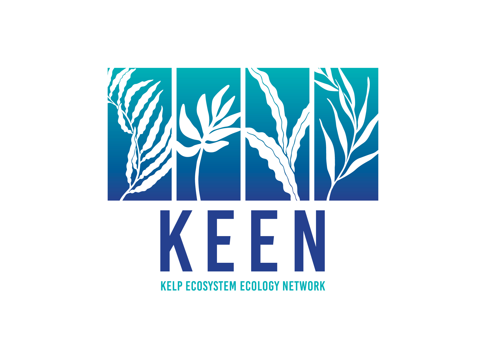

# Materials for the Kelp Ecosystem Ecology Network

This site contains the current KEEN handbook, data sheets, species guides, and data entry protocols and templates for both the KEEN removal and monitoring projects.

We've adopted version control so that members can access the latest materials and easily see what changes have been made via commit messages.

